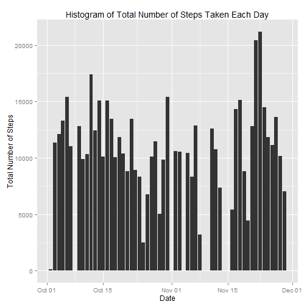
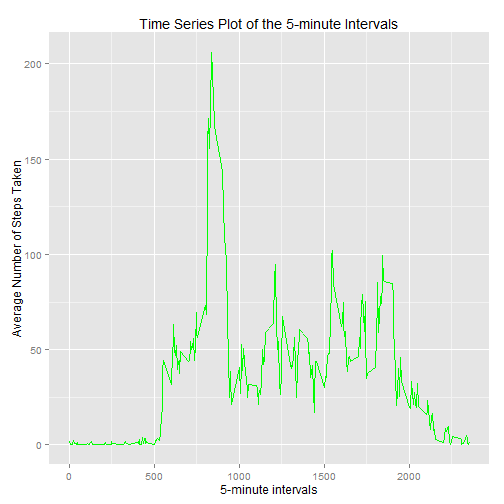
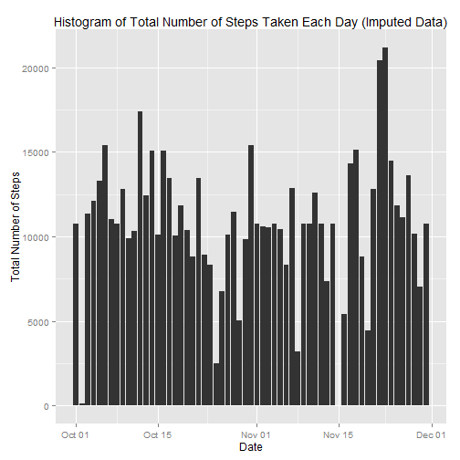

Reproducible Research - Peer Assessment 1
========================================================

This is an R Markdown document for peer assessment 1 of Coursera's Reproducible Research course.

Satvik Gadamsetty, 2014.

Loading basic packages.

```r
library(ggplot2)
```

Loading and processing data. Create a variable 'data' and assign the unzipped file to it using read.table()


```r
data <- read.table('activity.csv',sep = ",",header = TRUE, na.strings ="NA",
                   colClasses = c('integer','Date','factor'))
```

Removing rows with NA

```r
new.data <- na.omit(data)
```

Histogram of total number of steps taken per day; ignored missing values.

```r
total.steps <- tapply(new.data$steps, new.data$date, FUN = sum)
plot1 <- ggplot(new.data, aes(date, steps)) + geom_bar(stat = "identity",binwidth = .5) +
        labs(title = "Histogram of Total Number of Steps Taken Each Day",x = "Date", y = "Total Number of Steps")
print(plot1)
```

 

Mean total number of steps per day:

```r
mean(total.steps)
```

```
## [1] 10766
```

Median total number of steps per day:

```r
median(total.steps)
```

```
## [1] 10765
```

What is the average daily activity pattern?

```r
averages <- aggregate(new.data$steps, list(interval = as.numeric(as.character(new.data$interval))), FUN = "mean")
names(averages)[2] <- "Avg.Steps"

plot2 <- ggplot(averages, aes(interval, Avg.Steps)) + geom_line(color = "green", size = 0.7) + labs(title = "Time Series Plot of the 5-minute Intervals", x = "5-minute intervals", y = "Average Number of Steps Taken")
print(plot2)
```

 

Which 5-minute interval, on average across all days, contains the most steps?

```r
averages[averages$Avg.Steps == max(averages$Avg.Steps),]
```

```
##     interval Avg.Steps
## 104      835     206.2
```

Total number of incomplete cases

```r
sum(!complete.cases(data))
```

```
## [1] 2304
```

Imputing missing values by using mean for that 5-minute interval. 

```r
impData <- data 
for (i in 1:nrow(impData)) {
    if (is.na(impData$steps[i])) {
        impData$steps[i] <- averages[which(impData$interval[i] == averages$interval), ]$Avg.Steps
    }
}
```
Proof that all missing values have been filled in.

```r
sum(!complete.cases(impData))
```

```
## [1] 0
```

Histogram of total number of steps taken each day following missing value imputation. 

```r
plot3 <- ggplot(impData, aes(date, steps)) + geom_bar(stat = "identity",binwidth = .5) +
        labs(title = "Histogram of Total Number of Steps Taken Each Day (Imputed Data)",x = "Date", y = "Total Number of Steps")
print(plot3)
```

 
Mean total number of steps taken per day. Imputed dataset.

```r
total.steps.impute <- tapply(impData$steps, impData$date, FUN = sum)
mean(total.steps.impute)
```

```
## [1] 10766
```

Median total number of steps taken per day. Imputed dataset.

```r
median(total.steps.impute)
```

```
## [1] 10766
```
Comparing means and medians reveals that both new means are the same while the new median is greater than the old median.

Creating factor variables indicating whether the date is a weekday or weekend.

```r
impData$weekdays <- factor(format(impData$date, "%A"))
levels(impData$weekdays)
```

```
## [1] "Friday"    "Monday"    "Saturday"  "Sunday"    "Thursday"  "Tuesday"  
## [7] "Wednesday"
```

```r
levels(impData$weekdays) <- list(weekday = c("Monday", "Tuesday",
                                             "Wednesday", 
                                             "Thursday", "Friday"),
                                 weekend = c("Saturday", "Sunday"))
levels(impData$weekdays)
```

```
## [1] "weekday" "weekend"
```

```r
table(impData$weekdays)
```

```
## 
## weekday weekend 
##   12960    4608
```

Graphing panel plot containing time series plot of each 5-minute interval and the average number of steps taken, averaged across all days, split into weekdays and weekends.

```r
new.averages <- aggregate(impData$steps, 
                      list(interval = as.numeric(as.character(impData$interval)), 
                           weekdays = impData$weekdays),
                      FUN = "mean")
names(new.averages)[3] <- "meanOfSteps"
library(lattice)
plot4 <- xyplot(new.averages$meanOfSteps ~ new.averages$interval | new.averages$weekdays, 
       layout = c(1, 2), type = "l", 
       xlab = "Interval", ylab = "Number of steps")
print(plot4)
```

 

